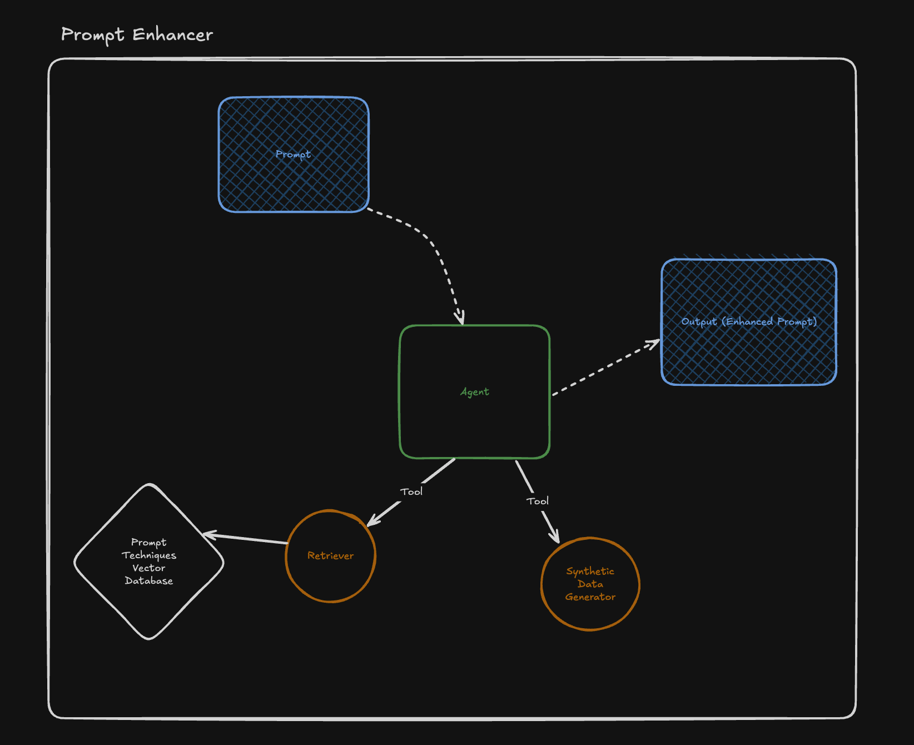

# Prompt Enhancer Agent

## Task 1: Defining your Problem and Audience

**One-Sentence Problem Description:**

Most users struggle to write effective AI prompts, resulting in poor output quality and wasted time.

**2\. Why This Is a Problem for the User:**  
 Professionals such as marketers, developers, researchers, and creators increasingly rely on AI tools to streamline their work. However, they often lack the expertise to craft precise, high-performing prompts. This leads to generic or off-target responses, forcing them to repeatedly slow down workflows and reducing trust in AI systems.

Our target users need reliable outputs quickly, whether it’s generating code, drafting content, or performing data analysis. A prompt enhancer rooted in deep research and RAG ensures their prompts are optimized using proven prompt engineering techniques from over a dozen research papers. This not only improves output quality but also saves valuable time and cognitive effort.

**What problem do you want to solve?**

The problem is ineffective prompts that yield low-quality AI responses. This affects users needing precision or creativity. We solve it by enhancing prompts using prompt engineering techniques grounded in research papers. 

**Who is it a problem for?**

It's a problem for users who rely on AI for accurate, creative, or task-specific outputs—like writers, developers, marketers, and researchers.

**Problem Statement:**

Users often struggle to craft effective prompts for AI models, leading to poor-quality or irrelevant outputs. This reduces productivity and increases trial-and-error efforts.

**Target User:**

* Job Titles: Content creators, marketers, developers, researchers, product managers, UX designers, students  
* Function Automated: Generating high-quality prompts for AI tools to improve output quality, save time, and reduce prompt iteration

**Potential User Questions:**

* *Why should I use a dedicated prompt enhancer instead of just asking an AI directly?*  
* *What makes your prompt enhancer more effective than regular prompt improvement tools?*  
* *How does using research-backed techniques improve my prompt quality?*  
* *What kind of prompt engineering methods do you use?*  
* *How is this better than prompt templates or prompt marketplaces?*  
  *Is your agent updated with the latest prompt engineering research?*

## 

## Task 2: Propose a Solution

**Write 1-2 paragraphs on your proposed solution. How will it look and feel to the user?**

My solution is a research driven prompt enhancer agent that automatically rewrites user prompts using advanced prompt engineering techniques from over a dozen academic papers. It leverages RAG to access a curated library of proven methods, enabling it to produce high-quality, optimized prompts without any user configuration or manual tuning.

From the user's perspective, the experience is seamless: they simply input a prompt, and the agent instantly returns a refined version—more specific, structured, and aligned with best practices.

**Describe the tools you plan to use in each part of your stack. Write one sentence on why you made each tooling choice.**

1. LLM: GPT-4.1  
2. Embedding Model: *text-embedding-3-small* \=\> fine tuned *snowflake-arctic-embed-l*  
3. Orchestration: [Mastra](https://mastra.ai/)  
4. Vector Database: PG Vector  
5. Monitoring: [Mastra](https://mastra.ai/)  
6. Evaluation:   
7. User Interface: [Mastra](https://mastra.ai/) for the certification project but it will be integrated to Prompt Lab for Demo day project.  
8. Serving & Inference: Vercel

**Where will you use an agent or agents? What will you use “agentic reasoning” for in your app?**

We will be using 1 agent for enhancing our prompt which will be structured as in the diagram.

## 

## Task 3: Dealing with the Data

**Describe all of your data sources and external APIs, and describe what you’ll use them for.**  
**ArXiv API**  
**Purpose:** To fetch up-to-date research papers related to prompt engineering, large language models, and instruction tuning.  
**Usage:** We will regularly query ArXiv for new papers in relevant categories and extract abstracts, full texts, and metadata for emeding them to our database.

**Describe the default chunking strategy that you will use. Why did you make this decision?**

Our default chunking strategy breaks text into sentence-based chunks with controlled character limits and sentence-level overlaps. This approach first splits text into sentences using punctuation markers, then groups those sentences into chunks that do not exceed a maximum character length. Additionally, a configurable number of overlapping sentences is added between chunks to preserve semantic continuity.

If sentence-based splitting is not viable (e.g., the text lacks clear punctuation), the fallback is a raw character-based chunking method.

**Why We Made This Decision:**

This chunking strategy ensures semantic coherence and embedding quality. Sentence boundaries help maintain meaning within chunks, avoiding mid-thought cuts that degrade vector embeddings. The character limit ensures compatibility with token constraints in embedding models. Sentence overlap allows smoother context transitions between chunks, which is particularly useful in research documents where ideas often span multiple sentences. This strategy balances performance, relevance, and embedding accuracy—critical for effective semantic search in our RAG-based system.

## Task 4: Building a Quick End-to-End Prototype

**Agent Repo:** [https://github.com/cantemizyurek/prompt-enhancer](https://github.com/cantemizyurek/prompt-enhancer)  
**Website Repo:**  [https://github.com/cantemizyurek/prompt-enhancer-web](https://github.com/cantemizyurek/prompt-enhancer-web)  
**Website Url:** [https://prompt-lab-enhancer.vercel.app/](https://prompt-lab-enhancer.vercel.app/)

## Task 5: Creating a Golden Test Data Set

**What conclusions can you draw about the performance and effectiveness of your pipeline with this information?**

I can conclude that our agent-based system significantly outperforms the naive approach of directly asking an LLM to enhance the prompt.

## Task 6: Fine-Tuning Open-Source Embeddings

**Embedding Model Url:** [https://huggingface.co/cantemizyurek/legal-ft-c9508ed2-5265-41e6-954d-f4f5e37c2371](https://huggingface.co/cantemizyurek/legal-ft-c9508ed2-5265-41e6-954d-f4f5e37c2371)

## Task 7: Assessing Performance

**How does the performance compare to your original RAG application?** 

Our previous RAG (Retrieval-Augmented Generation) model performed better, likely because the dataset we used for embedding consisted of only one paper. In contrast, the database now contains over 100 papers. Due to time constraints, I trained the embedding model using just that single paper.

**Articulate the changes that you expect to make to your app in the second half of the course. How will you improve your application?**

This enhancer is just one component of my main application, [**Prompt Lab**](https://promptlab.so). I plan to further develop the enhancer by building an agent that can automatically scrape arXiv for relevant papers, ensuring that we embed high-quality, targeted research instead of relying on a random selection of 100 prompt engineering papers. Additionally, I aim to create a new fine-tuned embedding model trained on a broader and more representative set of papers, rather than just a single document.
